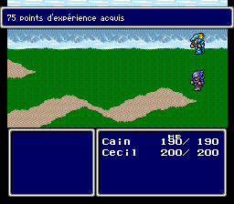
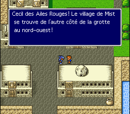
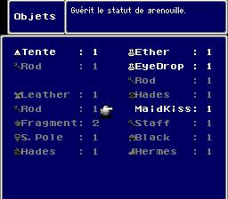
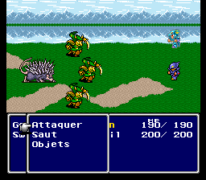
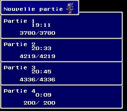
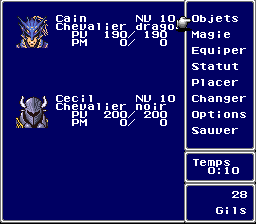
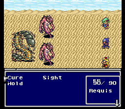

# Final Fantasy IV

## Building

The base ROM is not in the repository; decrypt the copy that is:

```shell
python3 -m venv .venv && .venv/bin/pip install -e '.[dev]'
gpg --decrypt ff4.sfc.gz.gpg | gunzip > build/ff4.sfc
make            # assembles build/ff4.ips, then runs the tests
```

`make check` verifies formatting and runs the a816 lints.

## Screenshots

### Variable width fonts



### Menus




