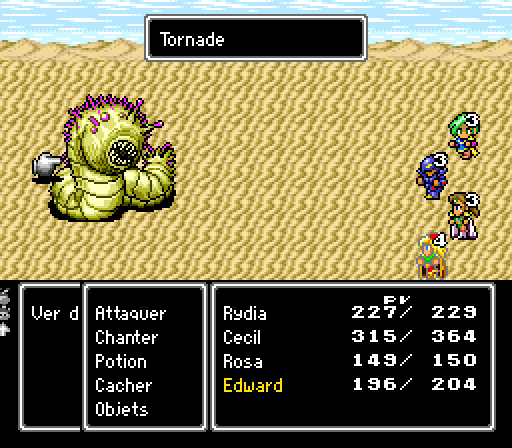
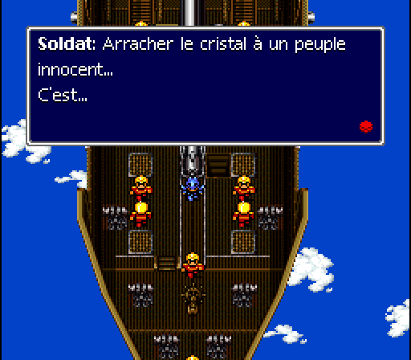
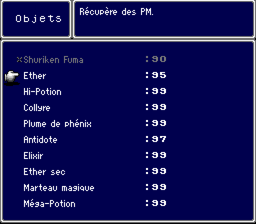
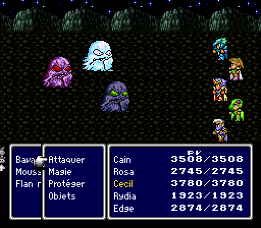
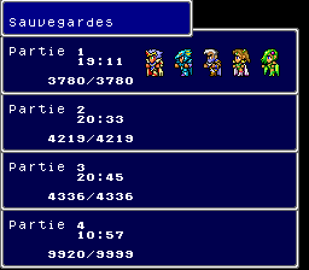
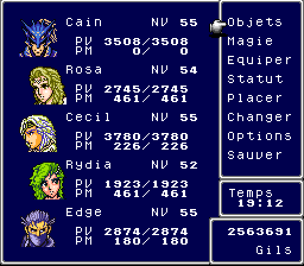
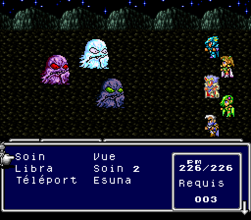

# Final Fantasy IV

## Building

Bring your own base ROM: an unheadered Final Fantasy IV (Japan) dump at
`build/ff4.sfc` (SHA-1 `eac14578b3465ffce874119005f9b244e8565a79`).
`ff4.sfc.gz.gpg` is CI's encrypted copy; its passphrase is not public.

```shell
python3 -m venv .venv && .venv/bin/pip install -e '.[dev]'
make            # assembles build/ff4.ips, then runs the tests
```

`make check` verifies formatting and runs the a816 lints.

## Screenshots

### Variable width fonts



### Menus




