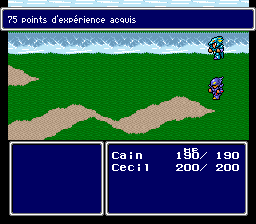

# Final Fantasy IV

To Bootstrap run the following command:
```shell
curl https://raw.githubusercontent.com/manz/ff4/master/bootstrap.sh | sh
```

## Screenshots

### Variable width fonts



### Menus


